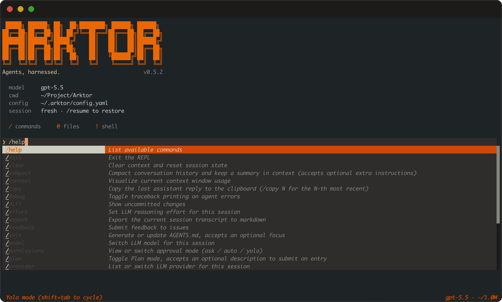

<p align="center">
  
</p>

<p align="center">
  <b>An agent harness you can run as a CLI and build on as an SDK.</b>
</p>

<p align="center">
  
  
  <a href="README_ZH.md"></a>
</p>

Arktor is a lightweight, hackable framework for building AI agents — and the tools, context,
and orchestration around them. It comes two ways in one package:

- **`arktor`** — an interactive agent in your terminal: streaming output, tool use, plan
  mode, persistent sessions, multimodal input.
- **`arktor-sdk`** — the Python SDK underneath: agents, tools, orchestration, memory,
  tracing, and hooks, every piece designed to be subclassed and swapped.

---

## Features

- **Batteries-included tools** — filesystem and a sandboxable terminal, web search & fetch,
  sub-agents, todo lists, cross-session memory, and skills..., plus research tools — paper search across
  arXiv & Semantic Scholar, and a document_parser that turns PDFs, scans, and images into
  clean markdown. Images and PDFs flow through as first-class attachments.
- **Observability built in** — every LLM call, tool, and step is a traced span, exported
  to the console and JSONL and surfaced through a rich set of hooks (the CLI's live
  progress runs on them).
- **Agents & orchestration** — ReAct, Plan-and-Execute, and Conversational agents,
  composable into pipelines, DAGs, routers, or teams.
- **Hackable throughout** — provider-agnostic LLMs with retry and fallback, 3-layer memory
  with auto-compression, approval policies, an optional Docker sandbox, and tuned built-in
  prompts — clean extension point.

---

## Install

```bash
git clone https://github.com/ygyang11/Arktor.git
cd Arktor

# create an environment (pick one)
conda create -n arktor python=3.11 && conda activate arktor
# or: python -m venv .venv && source .venv/bin/activate
# or: uv venv && source .venv/bin/activate

pip install -e ".[cli,app]"     # arktor CLI + built-in tools
```

For SDK use without the REPL:

```bash
pip install -e ".[dev,app]"
```

Add the `sandbox` extra for Docker-isolated tool execution.

### Configure

You only need to set three fields — model, API key, and base URL. Either drop an
`arktor.yaml` in your project (copy [`arktor_example.yaml`](arktor_example.yaml)), or run
`arktor` once and it writes a starter `~/.arktor/arktor.yaml` for you to edit:

```yaml
llm:
  provider: openai           # or: anthropic
  model: gpt-5.5
  api_key: sk-...
  base_url: ...
```

Everything else has sensible defaults and is fully customizable; common fields can also be
overridden with `ARKTOR_`-prefixed env vars (see [`.env_example`](.env_example)).

---

## Quickstart

### The CLI

<p align="center">
  
</p>

```bash
arktor
```

`arktor` starts an interactive agent rooted at your project directory. Attach files with
`@path`, run a shell command with `!cmd`, and open commands with `/`. Sessions persist, so
you can `/resume` later, and approval can switch between **Ask · Auto · Yolo** at any time.

Slash commands cover the whole loop — the most-used ones:

- **Plan & review** — `/plan` (read-only planning), `/review` (review the working diff),
  `/diff`, `/init` (generate `AGENTS.md`)
- **Session** — `/resume`, `/new`, `/compact` (compress context), `/export`, `/status`,
  `/context`
- **Model & runtime** — `/model`, `/effort`, `/provider`, `/permissions`, `/skills`,
  `/tasks`

Run `/help` to list them all.

### The SDK

Ten lines for a working tool-calling agent:

```python
import asyncio
from agent_harness import ReActAgent, tool, HarnessConfig

@tool
def calculate(expression: str) -> str:
    """Evaluate a math expression.

    Args:
        expression: A Python math expression like '2 + 3 * 4'.
    """
    return str(eval(expression))

async def main():
    agent = ReActAgent(
        name="assistant",
        tools=[calculate],
        config=HarnessConfig.load("arktor.yaml"),
    )
    result = await agent.run("What is (42 * 37 + 15) / 3?")
    print(result.output, "·", result.step_count, "steps")

asyncio.run(main())
```

`@tool` derives the JSON schema from your type hints and docstring. Core types import from `agent_harness`; the built-in tools live in `agent_app`
(e.g. `from agent_app.tools import WEB_TOOLS, FILESYSTEM_TOOLS`).

---

## Examples
  
For SDK users, Ready-to-run scripts under [`examples/`](examples/):

- **agents/** — [`react_agent`](examples/agents/react_agent.py),
  [`plan_and_execute`](examples/agents/plan_and_execute.py),
  [`multi_agent_pipeline`](examples/agents/multi_agent_pipeline.py), [`agent_team`](examples/agents/agent_team.py),
  [`deep_research`](examples/agents/deep_research.py).
- **features/** — [`coding_demo`](examples/features/coding_demo.py), [`session_demo`](examples/features/session_demo.py),
  [`skill_demo`](examples/features/skill_demo.py).

```bash
python examples/agents/react_agent.py        # ReAct loop with custom tools
```

---

## Contributing

Contributions are welcome. For
anything substantial, please open an issue to discuss the approach first, and keep changes
consistent with the existing style.

Released under the [MIT License](LICENSE).
